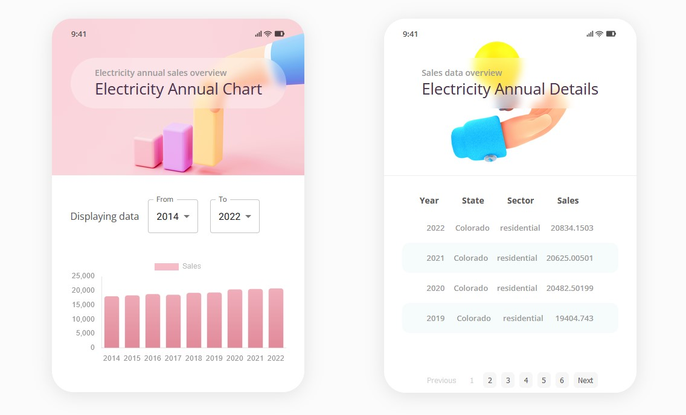

# Data Visualization API - Chart & Table

Implementing an Data Visualization using Chart.js.

👉 [Watch DEMO](https://Frnt-End.github.io/Data-Visualization-Chartjs-React-Typescript)

### Project Details

- Fetch API data and display bar chart and table.
- the chart contain a filter menu to select a range of years to be displayed in the chart.
- The table contain pagination.

### Technologies

- React & Vite.
- Chart.js.
- Axios.
- TypeScript.
- MUI + Styled Components.

## Run project

Install all the dependencies used in this project:

`npm install`

In the project directory, you can run:

`npm run dev`

Runs the app in the development mode.\
Open [http://127.0.0.1:5173/](http://127.0.0.1:5173/) to view it in the browser.
